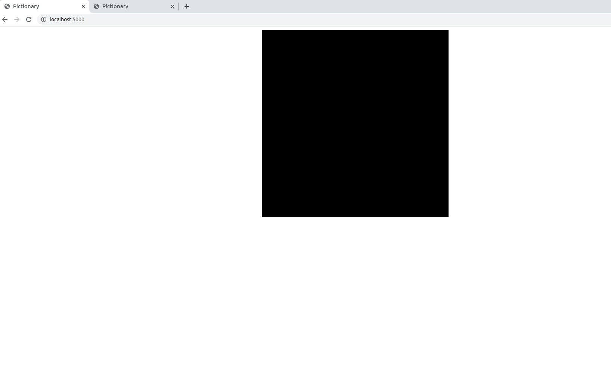
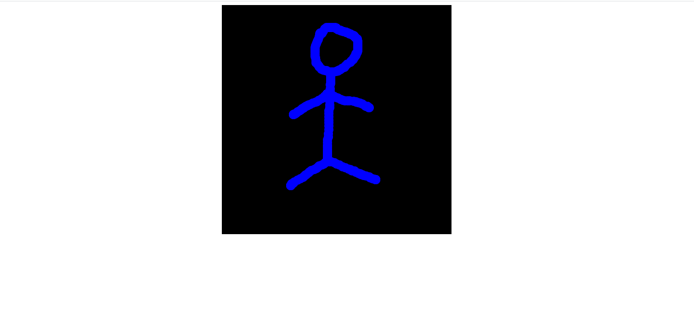
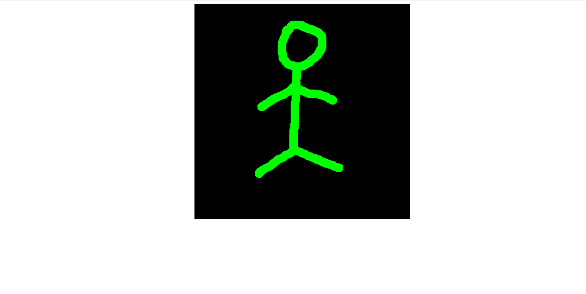

# pictionary

This is a node application that uses web sockets specifically the [socket.io](https://socket.io/) module to redraw a
second p5 sketch in real time.

## Demonstration

To run the application first run `npm install` then run `npm start`. Open the browser on `localhost://5000` then open another one.

Left click your mouse to draw on the sketch.

open the second tab and you will see the same drawing but with a different color.

